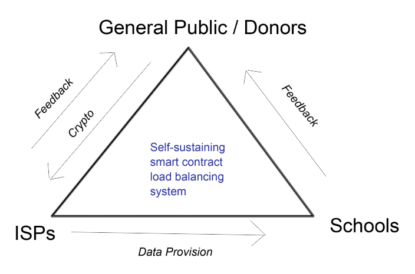

# UNICEF Challenge: Reducing the divide

**Version 1.0.0**

A Dapp that manages internet connectivity across various schools in a fair, transparent and self sustaining way.

-   [ Click here to use working version](1Clickheretovisitdeployedversion)

## Table Of Content

1. [Installation](#Installation)

2. [Documentation](#Documentation)

    - [Scope and Overview](#ScopeandOverview)
    - [Assumptions](#Assumptions)
    - [Additional Mechanisms](#AdditionalMechanisms)
    - [Tech Stack and Tools](#TechStackandTools)
    - [Smart Contract Architecture](#SmartContractArchitecture)
    - [Improvements](#Improvements)

3. [Thanks](#Thanks)

4. [Copyright and license](Copyrightandlicense)

<h2 name="Installation">Installation</h2>

    - git clone https://github.com/Christopher-I/UNICEFConnectKids
    - cd UNICEFConnectKids
    - npm run i
    - $ npm run dev

<h2 name="Documentation">Documentation</h2>

<h3 name="ScopeandOverview">Scope and Overview</h3>

    -Country: Nigeria.

    -Participants: The General Public / Donors, ISPs and Schools.

    -Sample size : 3 schools and 3 ISPs.

<h3 name="Assumptions">Assumptions</h3>

    - Payments to ISPs are in ETH/ERC20

    - Connectivity information such as upload/download speed is received via a solidity smart contract from ISPs and Schools.

    - An average mean upload /download speed and data size provision are sent every day from the schools and ISPs.

    - One ISP at a time is responsible for providing connectivity to all schools within a country(future iterations will allow multiple ISPs to manage different schools within a country).

    -ISPs and Schools apply to be part of the Dapp and are approved by an admin (to prevent spamming of the network and ensure all participants are real).

<h3 name="AdditionalMechanisms">Additional Mechanisms</h3>

    -The current ISP provider is chosen by a bidding system via a smart contract based on quality of service it promises to provide( faster download/upload speeds) and its previous history of perfomance. This way the best service providers over time will have a bidding advantage.

    -ISP perfomance are graded at the end of an appriopriate cycle period(example 30 days) and payments are made after grading depending on ISP grade.

    -After every succesful grade at the end of cycle, ISP recieve 'consistency points' which are a positive factor when bidding for future ISP opportunities.

<h3 name="TechStackandTools">Tech Stack and Tools</h3>

    -Blockchain protocol - Ethereum(Rinkeby Network).

    -Front End - JavaScript, React, Html, CSS.

    -Back End - Solidity, Node.js, NextJs.

    -Other Libraries and Tools - ETH Timer, Truffle, Web3.

<h3 name="SmartContractArchitecture">Smart Contract Architecture</h3>

Actors:

Smart Contract Architecture:

    -Main Smart Contract: It oversees the creation and managment of 'country manager' smart contracts.

    -Country Manager Contract: It oversees the creation and managment of ISP and school smart contract. It also keeps a record of all financial and data connectivity information within a country.

    -School Contract : Defines the identity of each school on the platform and sends connectivity information to its overseeing country manager smart contract.

     -ISP Contract : Defines the identity of each ISP on the platform and sends connectivity information to its overseeing country manager smart contract. It also receives funds sent my smart contracts at the end of each cycle. The controller of this contract should be respresentative of the ISP.

<h3 name="Improvements">Improvements</h3>

    -Complete algorithm that switches between different ISP providers based on their offer and repuatation.

    -Add more countries and schools to platform.

    -Include the option of allowing different ISPs to bid on different schools within a country.

    -Improve Admin page to include the option of accepting applications from schools and ISPs.

    -Hook-in ETH timer and run a test model.

    -Include security measures to protect all users incase of a future vunerablity.

    -Improve smart contract upgradability without compromising user experience and perfomance.

    -Add login pages for ISPs and school to manage their application status. ISPs to place bids on different schools.

<h2 name="Thanks">Thanks</h2>

A big thank you to UNICEF and gitcoin for providing this opportunity to create a Dapp that can benefit communities across that world that are in need of assistance. The project created with a lot passion for its cause and I hope we can continue the great work!

© Christopher Igbojekwe
