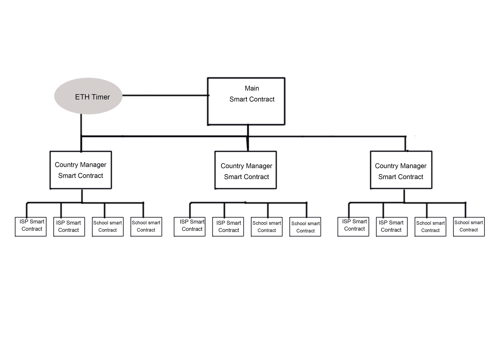

# UNICEF Challenge: Reducing the divide

**Version 1.0.0**

-   [ Link to working Dapp](1Clickheretovisitdeployedversion)

## Table Of Content

1. [Installation](#Installation)

2. [Documentation](#Documentation)

    - [Scope and Overview](#ScopeandOverview)
    - [Assumptions](#Assumptions)
    - [Additional Mechanisms](#AdditionalMechanisms)
    - [How To Use](#HowToUse)
    - [Tech Stack and Tools](#TechStackandTools)
    - [Smart Contract Architecture](#SmartContractArchitecture)
    - [Improvements](#Improvements)

3. [Thanks](#Thanks)

4. [Copyright and license](#License)

<h2 name="Installation">Installation</h2>

    - git clone https://github.com/Christopher-I/UNICEFConnectKids
    - cd UNICEFConnectKids
    - npm run i
    - $ npm run dev

<h2 name="Documentation">Documentation</h2>

Goal: Create a dapp that manages internet connectivity and transactions for schools across the world in a fair, transparent and self-sustaining approach.

<h3 name="ScopeandOverview">Scope and Overview</h3>

    -Country: Nigeria.

    -Participants: The General Public / Donors, ISPs and Schools.

    -Sample Size : 3 schools and 3 ISPs.

<h3 name="Assumptions">Assumptions</h3>

    - Payments to ISPs are in ETH/ERC20

    -Data Source: All data connectivity information and crypto-currency transctions used in Dapp are retrieved from the ethereum blockchain.

    - Connectivity information such as upload/download speed is received via a solidity smart contract from ISPs and Schools.

    - An average mean upload /download speed and data size provision are sent every day from the schools and ISPs.

    - One ISP at a time is responsible for providing connectivity to all schools within a country(future iterations will allow multiple ISPs to manage different schools within a country).

    -ISPs and Schools apply to be part of the Dapp and are approved by an admin (to prevent spamming of the network and ensure all participants are real).

    -All participants can use basic ethereum based tools such as metamask  and etherscan.

    -All transactions and daily connectivity data is stored on the ethereum blockchain.

    -Dapp automatically manages the selection of ISP providers and the prioritization of schools to receive internet connection.

<h3 name="AdditionalMechanisms">Additional Mechanisms</h3>

    -The current ISP provider is chosen by a bidding system via a smart contract based on quality of service it promises to provide( faster download/upload speeds) and its previous history of performance. This way the best service providers over time will have a bidding advantage.

    -ISPs perfomance are graded at the end of an appropriate cycle period(example 30 days) and payments are made after grading depending on ISP grade.

    -After every succesful grade at the end of cycle, ISP receive 'consistency points' which are a positive factor when bidding for future ISP opportunities.

    -Schools are prioritized for connectivity by the smart contract based on factors such as population and location.

<h3 name ="#HowToUse">How To Use</h3>

-   [Scope and Overview](#ScopeandOverview)

OR

-   Guidelines

         Wallet Settings : This Dapp was designed to work with metamask, so please sign into metamask and ensure you are on the Rinkeby Network.

         Start

-   Clone this repo. Then navigate to the root directory of repo.
-             \$ npm i

          Deploy a new contract to Rinkeby

              - $ cd ethereum
              - $ node compile
              - $ node deploy
              - Copy main contract address that will be displayed on command line.
              - $ touch ListofSmartCOntractAddresses
              - Paste main contract address into variable called Main Contract Address ALSO paste your address into the owner address variable, this will be used to access all the smart contracts during the test phase.

          Deploy a new country manager

              -return to the root folder of the repo

              - $ npm run dev

              - open http://localhost:3000/ in your browser

              - Click Log In button at the top right of the menu bar and then click ok when prompted for user name/password(no need to enter any information). You should be automatically redirected to the admin console.

              - In the section labelled "Add New Country Manager", enter the name of the country(Nigeria) you wish to create and click register. Copy the newly deployed country contract address which will be displayed on the screen below the register button.

              - $ cd ethereum && touch ListofSmartContractAddressses.

              - paste the address into the variable called "country manager address".

          Deploy a new school/ISP contract

              - open http://localhost:3000/ in your browser

              - Click apply as School / ISP and completely fill all the information in the forms. It is recommended you use the following school names and locations below as they are already preconfigured to display on the map and are also real schools in Nigeria that are a part of the Unicef program - http://school-mapping.azurewebsites.net/

                  - Name: "Holy Trinity Primary School", Population: "enter a number", Location: "Lagos", OwnersAddress: "enter your eth address or any prefrred eth address"

                  - Name: "Garam Primary School", Population:"enter a number", Location:"Kaduna",OwnersAddress:"enter your eth address or any prefrred eth address"

                  - Name: "Glisten Academy", Population:"enter a number", Location:"Abuja",OwnersAddress:"enter your eth address or any prefrred eth address"

              - Click register, and the newly deployed schools address will display at bottom of the screen. Return to overview page by clicking the home buttom at the top right corner in the menu. You should all see all the newly created ISP and school information displayed.

<h3 name="TechStackandTools">Tech Stack and Tools</h3>

    -Blockchain protocol - Ethereum(Rinkeby Network).

    -Front End - JavaScript, React, Html, CSS.

    -Back End - Solidity, Node.js, NextJs.

    -Other Libraries and Tools - ETH Timer, Truffle, Web3.

<h3 name="SmartContractArchitecture">Smart Contract Architecture</h3>

    -The Ethereum Alarm Clock is a service that allows scheduling transactions to be executed at a later time on the ethereum blockchain- Eth alarm clock website. This will be used to safely make calls to the smart contracts at the end of each cycle.

    -Main Smart Contract: It oversees the creation and managment of 'country manager' smart contracts.

    -Country Manager Contract: It oversees the creation and management of ISP and school smart contracts. It also keeps a record of all financial and data connectivity information within a country.

    -School Contract : Defines the identity of each school on the platform and sends connectivity information to its overseeing country manager smart contract.

     -ISP Contract : Defines the identity of each ISP on the platform and sends connectivity information to its overseeing country manager smart contract. It also receives funds sent my smart contracts at the end of each cycle. The controller of this contract should be a representative of the ISP.

<h3 name="Improvements">Improvements</h3>

    -Refine smart contract algorithm that automatically switches between different ISP providers based on their offer and reputation.

    -Refine  algorithm that prioritized the next school to provide connectivity based on factors such as population and location.

    -Create a viable option of accessing Dapp from an internet browser without a wallet or metamask. That way more participants can be use the platform.

    -Limit accessibility(from public to restricted) of relevent smart contract functions after further testing

    -Create dispute management function for cases where ISPs and school provide largely varying data.

    -Create a UI mechanism to easily onboard new schools on map based on their location.

    -Add more countries and schools to platform.

    -Include the option of allowing different ISPs to bid on different schools within a country.

    -Improve Admin page to include the option of accepting applications from schools and ISPs.

    -Hook-in ETH timer.

    -Include security measures to protect all participants in case of a future vulnerability to Dapp.

    -Improve smart contract upgradability without compromising user experience, safety and performance.

    -Add login pages for ISPs and school to manage their application status. ISPs to place bids on different schools.

<h2 name="Thanks">Thanks</h2>

A big thank you to UNICEF and gitcoin for providing this opportunity to create a Dapp that can benefit communities across that world that are in need of assistance. The project created with a lot passion for its cause and I hope we can continue the great work!

<h2 name="License">Copyright and license</h2>

@@ -0,0 +1,21 @@ MIT License

Copyright (c) 2019 Christopher Igbojekwe

Permission is hereby granted, free of charge, to any person obtaining a copy of this software and associated documentation files (the "Software"), to deal in the Software without restriction, including without limitation the rights to use, copy, modify, merge, publish, distribute, sublicense, and/or sell copies of the Software, and to permit persons to whom the Software is furnished to do so, subject to the following conditions:

The above copyright notice and this permission notice shall be included in all copies or substantial portions of the Software.

THE SOFTWARE IS PROVIDED "AS IS", WITHOUT WARRANTY OF ANY KIND, EXPRESS OR IMPLIED, INCLUDING BUT NOT LIMITED TO THE WARRANTIES OF MERCHANTABILITY, FITNESS FOR A PARTICULAR PURPOSE AND NONINFRINGEMENT. IN NO EVENT SHALL THE AUTHORS OR COPYRIGHT HOLDERS BE LIABLE FOR ANY CLAIM, DAMAGES OR OTHER LIABILITY, WHETHER IN AN ACTION OF CONTRACT, TORT OR OTHERWISE, ARISING FROM, OUT OF OR IN CONNECTION WITH THE SOFTWARE OR THE USE OR OTHER DEALINGS IN THE SOFTWARE.
